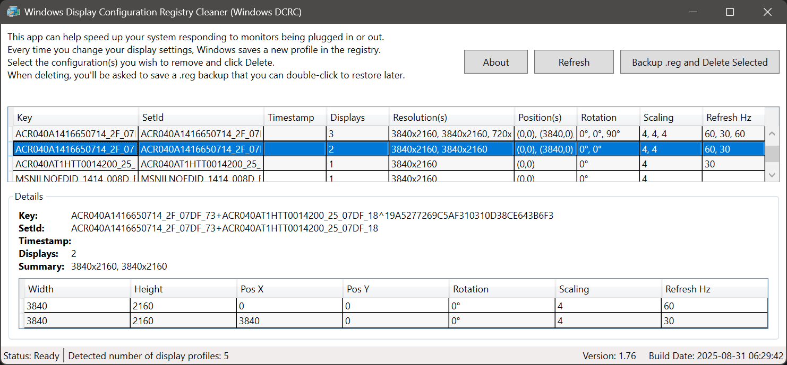

Windows Display Configuration Registry Cleaner (Windows DCRC)

Overview

- Safely view, back up (.reg), and delete stale Windows display configuration records.
- Registry path: HKEY_LOCAL_MACHINE\SYSTEM\CurrentControlSet\Control\GraphicsDrivers\Configuration
- Tech stack: .NET 8 WPF (C#), WiX installer (MSI).

Key Features
- Scan both 64-bit and 32-bit registry views; de-duplicate keys.
- Grid view with per-entry columns: Key, SetId, Timestamp (local time), Displays, Resolution(s), Position(s), Rotation, Scaling, Refresh Hz.
- Details pane with read-only display-node list: Width, Height, PositionX/Y, Rotation, Scaling, Refresh Hz.
- Backup on delete: prompts to export selected/all keys to a single Unicode .reg (header once; per-key exports merged) before deletion.
- Delete from both Registry64 and Registry32 views; requires elevation (Admin manifest).
- Refresh button to re-scan at any time.

Safety
- Deletes are gated by a confirmation dialog and require Admin.
- If registry read/export fails, a clear message is shown.

Build (Dev)
1) Prereqs: .NET 8 SDK on Windows 10/11.
2) Build and run (elevated due to manifest):
   - dotnet build
   - dotnet run

Installer (MSI)
- Use tools/BuildInstaller.ps1 to publish a self-contained single-file app and build an MSI with WiX 3 (includes Finish-page checkbox to launch the app):
  - pwsh -NoProfile -ExecutionPolicy Bypass -File .\tools\BuildInstaller.ps1
- Outputs: dist/WindowsDCRC_<version>.msi

Optional Signing
- Provide a code-signing PFX to sign the EXE and MSI:
  - pwsh -NoProfile -ExecutionPolicy Bypass -File .\tools\BuildInstaller.ps1 -SignCertPath C:\path\cert.pfx -SignCertPassword "your-password"
- For local testing, you can generate a dev cert and trust it (only trusted on your machine).

Manual Test Flow
1) Click "Backup .reg and Delete All/Selected" to save and remove entries.
2) Click Refresh to verify changes.
3) Double-click the saved .reg to restore; Refresh again to see entries reappear.

Permissions
- The app manifest requests requireAdministrator.

Project Structure
- UI: MainWindow.xaml
- Logic: MainWindow.xaml.cs (scanner, models, export, delete, handlers)
- Installer: installer/Product.v3.wxs (WiX 3), installer/EULA.rtf
- Build script: tools/BuildInstaller.ps1

License
- GPL-3.0 (see LICENSE).

Disclaimer
- Provided "AS IS" without warranties; use at your own risk. Always create a backup before deleting registry entries.

